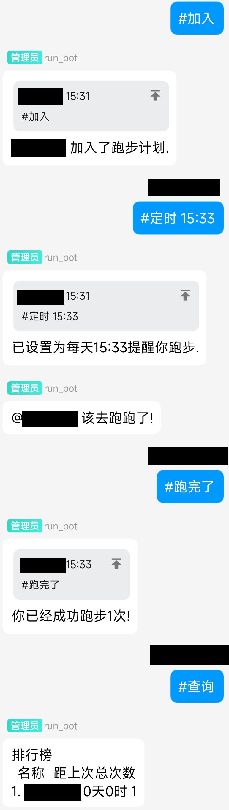

# Run bot

基于[oicq](https://github.com/takayama-lily/oicq)和[oicq-template](https://github.com/takayama-lily/oicq-template)的QQ机器人,用来提醒你和群友执行跑步计划.

## Install

1. 安装 [Node.js](https://nodejs.org/) 14以上版本  
2. clone到本地并执行 `npm i` 安装依赖
3. 将 index.js 第二行 `const account = 0` 中的0改为你自己的账号
4. 执行 `npm run dev` 启动程序

如果你已经有了一个机器人,也可以直接在代码中导入`plugin-run.js`.

## Usage

|   Method    |            Description            |
| :---------: | :-------------------------------: |
|    #加入    |           加入跑步计划            |
|    #查询    |            查看排行榜             |
|   #跑完了   |        完成当天的跑步计划         |
| #定时 时:分 |      指定一个时间点,提醒跑步      |
|   #间隔 x   |        设置为每x天提醒一次        |
|   #开摆 x   |       休息x天,期间停止提醒        |
|    #退出    | 不会产生任何效果,这是为了磨练意志 |
|    #帮助    |           提示上述指令            |
|    #save    |           手动备份数据            |
|    #load    |         读取手动备份数据          |

凡是带有参数的命令,省略参数部分即可恢复为默认值.

通过#save命令手动备份的数据在`run_bot.dat.bak`中.

bot运行时的数据会被自动备份到`run_bot.dat` 中.

